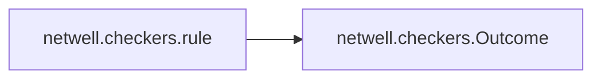

# Netwell Checkers

[_Documentation generated by Documatic_](https://www.documatic.com)

<!---Documatic-section-Codebase Structure-start--->
## Codebase Structure

<!---Documatic-block-system_architecture-start--->
```mermaid
None
```
<!---Documatic-block-system_architecture-end--->

# #
<!---Documatic-section-Codebase Structure-end--->

<!---Documatic-section-netwell.checkers.rule-start--->
## [netwell.checkers.rule](4-netwell_checkers.md#netwell.checkers.rule)

<!---Documatic-section-rule-start--->


### Object Calls

* netwell.checkers.Outcome

<!---Documatic-block-netwell.checkers.rule-start--->
<details>
	<summary><code>netwell.checkers.rule</code> code snippet</summary>

```python
@contextmanager
def rule(description):
    output.info(description + '... ')
    outcome = Outcome()
    try:
        result.checks += 1
        yield outcome
    except RuleFailedException:
        pass
    except:
        outcome.failed = True
    if outcome.failed:
        result.failures += 1
        if outcome.message:
            output.error('ERROR')
            output.eol()
            output.error('ERROR: ' + outcome.message)
        else:
            output.error('ERROR')
    else:
        output.info('OK')
    output.eol()
```
</details>
<!---Documatic-block-netwell.checkers.rule-end--->
<!---Documatic-section-rule-end--->

# #
<!---Documatic-section-netwell.checkers.rule-end--->

[_Documentation generated by Documatic_](https://www.documatic.com)